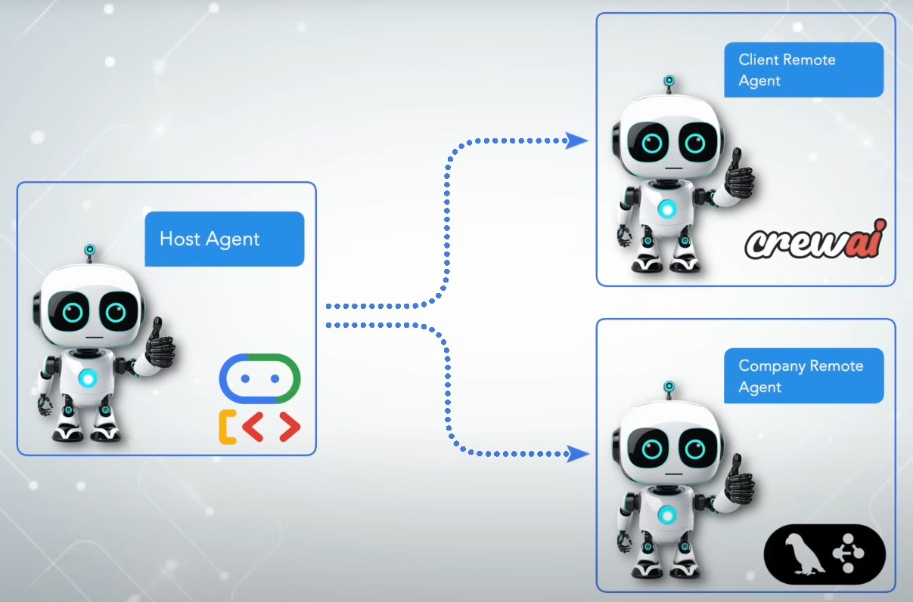
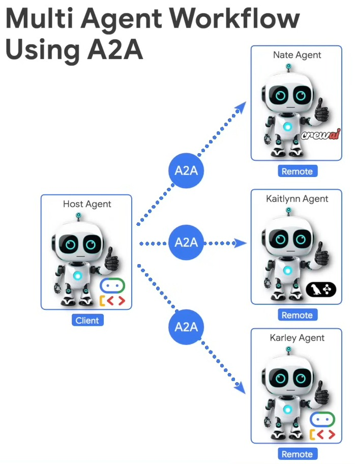

# <h1 align="center">Agent2Agent (A2A) Protocol</h1>

Senior Data Scientist.: Dr. Eddy Giusepe Chirinos Isidro

O protocolo Agent2Agent (A2A - Lançado pela `Google`) aborda um desafio crítico no cenário da IA: permitir que agentes de IA de geração, desenvolvidos em diversas estruturas por diferentes empresas e executados em servidores separados, se comuniquem e colaborem de forma eficaz — como agentes, não apenas como ferramentas. O A2A visa fornecer uma linguagem comum para agentes, promovendo um ecossistema de IA mais interconectado, poderoso e inovador.

Com o A2A, os agentes podem:

* Descubrir as capacidades de cada um.
* Negociar modalidades de interação (texto, formulários, mídia).
* Colabore com segurança em tarefas de longa duração.
* Operar sem expor seu estado interno, memória ou ferramentas.

Abordaremos da seguinte maneira:

Phase 1: `A2A Basic`

* Por que necessitamos de A2A?
* Quais são os conceitos principais?
* Como tudo se conecta?

Phase 2: `A2A Simple Workflow`

* Client <---> A2A Protocol <---> AI Agents

Phase 3: `Multi Agent Workflow Using A2A`

Thank God!
