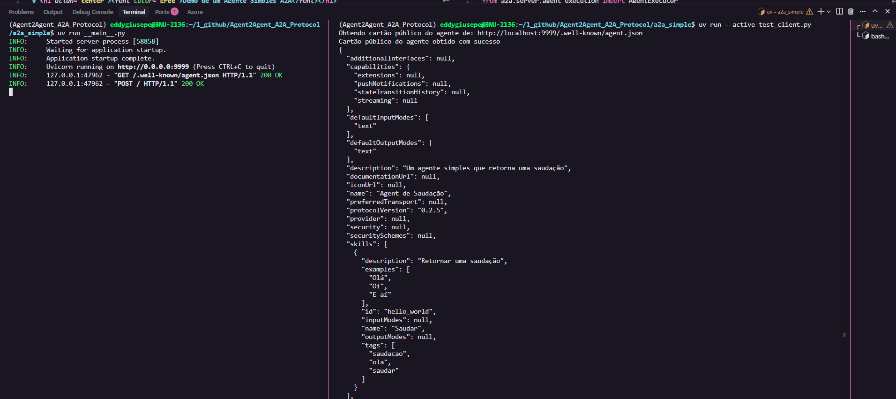

# <h1 align="center"><font color="gree">Demo de um Agente Simples A2A</font></h1>

Este documento descreve um agente simples e um cliente demonstrando o SDK ``Agent to Agent`` (A2A).

Esta aplicação contém um agente simples e um cliente para invocar.

## <font color="red">Configuração e Deployment</font>

### <font color="blue">Pré-requisitos</font>

Antes de executar a aplicação localmente, certifique-se de que você tem o seguinte instalado:

1. ``uv``: A ferramenta de gerenciamento de pacotes Python usada neste projeto. Siga o guia de instalação: [Installing uv](https://docs.astral.sh/uv/getting-started/installation/)

2. ``python 3.13``: Python 3.13 é necessário para executar ``a2a-sdk``

### <font color="blue">``1.`` Instalar as dependências</font>

```bash
uv venv
source .venv/bin/activate
```

### <font color="blue">``2.`` Executar o Agente</font>

Abra um terminal e execute o servidor (``server``) com o agente dummy:

```bash
uv run .

ou

uv run __main__.py
```

O agente será executado em ``http://localhost:9999``.

### <font color="blue">``3.`` Executar o Cliente de Teste</font>

Abra um novo terminal e execute o cliente (``test_client``):

```bash
uv run --active test_client.py

ou 

uv run test_client.py
```

Você verá o cliente interagir com o agente no terminal.


Exemplo de saída:




## <font color="red">Referências</font>

- [a2a-python](https://github.com/a2aproject/a2a-python)

- [Codelabs: Como começar a usar o protocolo Agent-to-Agent (A2A)](https://codelabs.developers.google.com/intro-a2a-purchasing-concierge?hl=pt-br#1)


- [Agent2Agent (A2A) Crash Course: Full Walkthrough With Real Multi-Agent Examples](https://www.youtube.com/watch?v=mFkw3p5qSuA)

- [A2A](https://github.com/a2aproject/A2A)

- [a2a-samples](https://github.com/a2aproject/a2a-samples/tree/main)

